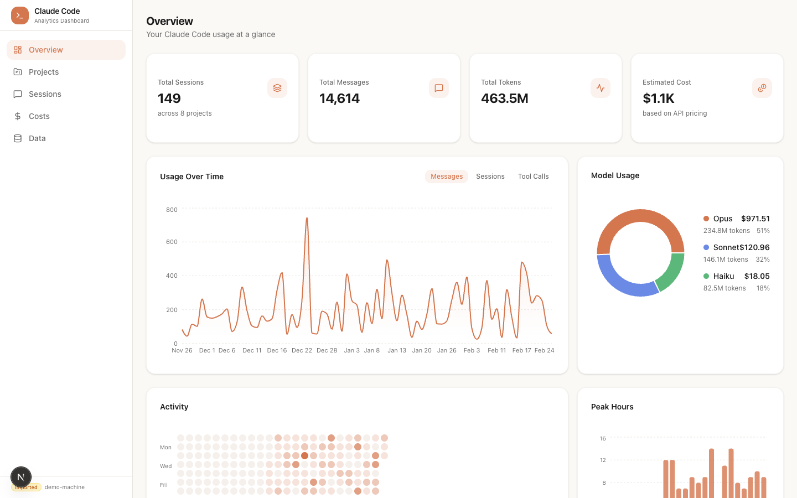
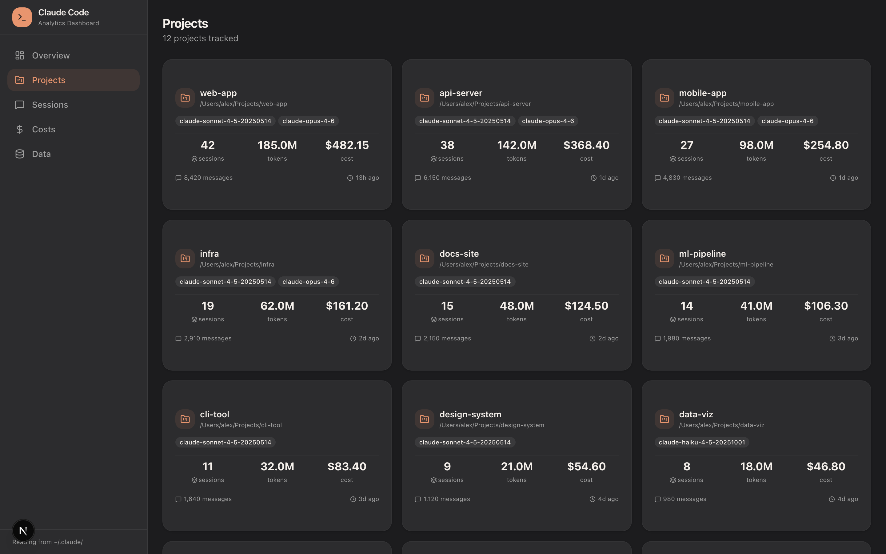
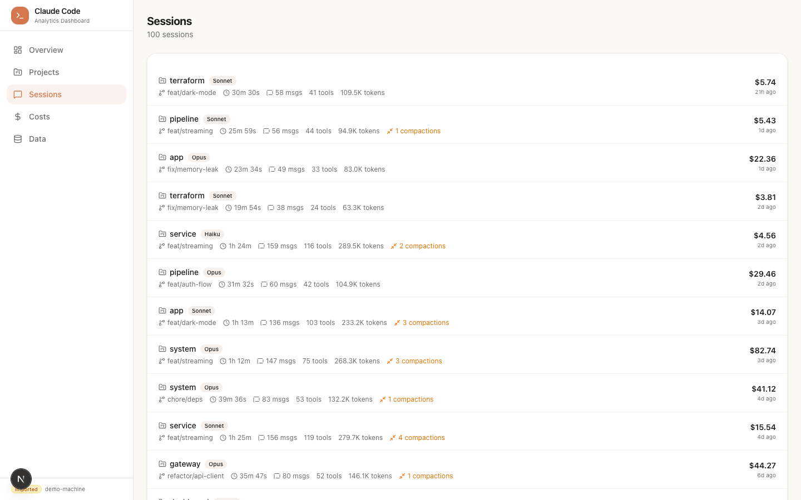
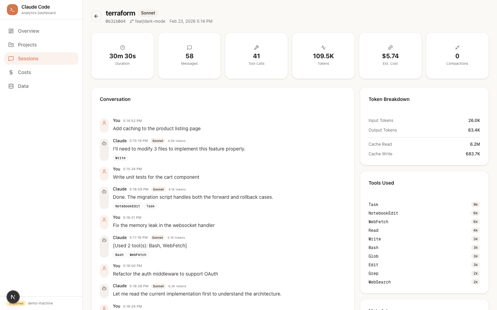
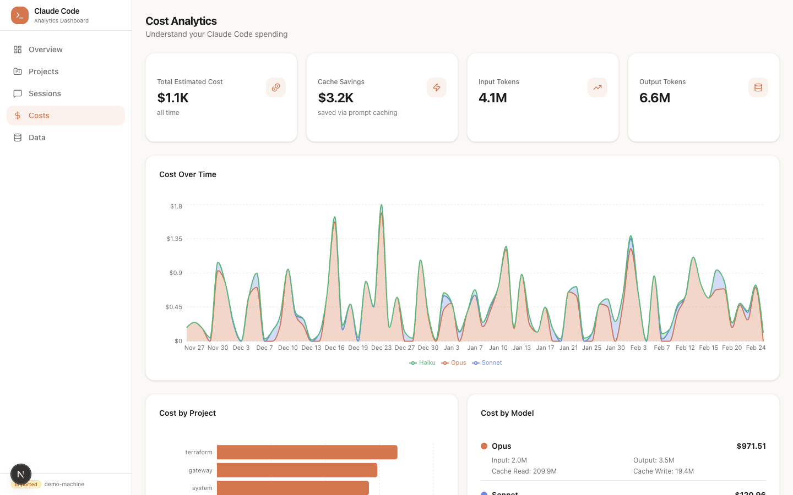
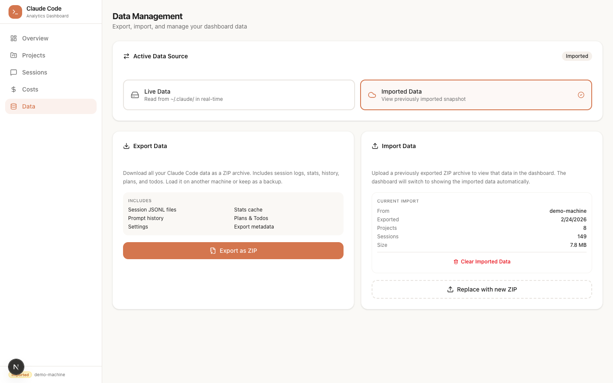

# Claud-ometer

A local-first analytics dashboard for [Claude Code](https://docs.anthropic.com/en/docs/claude-code). Reads directly from `~/.claude/` to give you full visibility into your usage, costs, sessions, and projects — no cloud, no telemetry, just your data.



## Features

**Dashboard Overview** — Total sessions, messages, tokens, and estimated costs at a glance. Usage-over-time charts, model breakdown donut, GitHub-style activity heatmap, and peak hours distribution.

**Projects** — See all your Claude Code projects with session counts, token usage, cost estimates, and last activity. Drill into any project to see its sessions and most-used tools.



**Sessions** — Browse all sessions with duration, message count, tool calls, token usage, and cost. Compaction events are highlighted in amber so you can see which sessions hit context limits.



**Session Detail** — Full conversation replay with user prompts and Claude responses, tool call badges, token-per-message counts, and a sidebar with token breakdown, tools used, compaction timeline, and metadata.



**Cost Analytics** — Cost-over-time stacked by model, cost-by-project bar chart, per-model token breakdown, cache efficiency metrics, and a pricing reference table.



**Data Export/Import** — Export all your Claude Code data as a ZIP. Import it on another machine to view the same dashboard. Toggle between live and imported data sources.



### What data does it read?

| Source | Path | Contains |
|--------|------|----------|
| Session logs | `~/.claude/projects/<project>/<session>.jsonl` | Every message, tool call, token usage, model, timestamps, compaction events |
| Stats cache | `~/.claude/stats-cache.json` | Pre-computed daily activity, model usage, hourly distribution |
| History | `~/.claude/history.jsonl` | Every prompt you've typed with project context |
| Plans | `~/.claude/plans/*.md` | Implementation plans from sessions |
| Todos | `~/.claude/todos/*.json` | Task lists from sessions |

## Quick Start

```bash
git clone https://github.com/deshraj/Claud-ometer.git
cd Claud-ometer
npm install
npm run dev
```

Open [http://localhost:3000](http://localhost:3000). The dashboard reads from your local `~/.claude/` directory automatically.

## Tech Stack

- **Next.js 15** (App Router, Turbopack)
- **TypeScript**
- **Tailwind CSS v4** + **shadcn/ui**
- **Recharts** for charts
- **SWR** for data fetching
- **Lucide** icons

No database required. Reads `~/.claude/` files directly via Node.js API routes.

## Project Structure

```
src/
├── app/
│   ├── page.tsx                 # Overview dashboard
│   ├── projects/                # Projects list + detail
│   ├── sessions/                # Sessions list + detail
│   ├── costs/                   # Cost analytics
│   ├── data/                    # Export/import management
│   └── api/
│       ├── stats/               # Dashboard stats
│       ├── projects/            # Project data
│       ├── sessions/            # Session list + detail
│       ├── export/              # ZIP export
│       ├── import/              # ZIP import
│       └── data-source/         # Live vs imported toggle
├── components/
│   ├── charts/                  # Recharts components
│   ├── cards/                   # Stat cards
│   └── layout/                  # Sidebar
├── lib/
│   ├── claude-data/
│   │   ├── types.ts             # TypeScript interfaces
│   │   ├── reader.ts            # File parsers + aggregation
│   │   └── data-source.ts       # Live vs imported source
│   ├── hooks.ts                 # SWR hooks
│   └── format.ts                # Number/date formatters
└── config/
    └── pricing.ts               # Model pricing + cost calculator
```

## Data Export/Import

Export your data to share across machines or keep as a backup:

1. Go to the **Data** page in the sidebar
2. Click **Export as ZIP** to download all your Claude Code data
3. On another machine, upload the ZIP via **Import** to view the dashboard with that data
4. Toggle between **Live** (reads ~/.claude/) and **Imported** data at any time

## License

MIT
